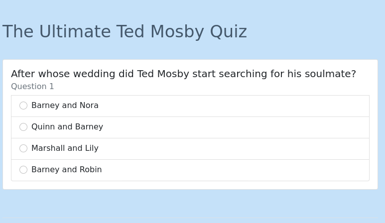
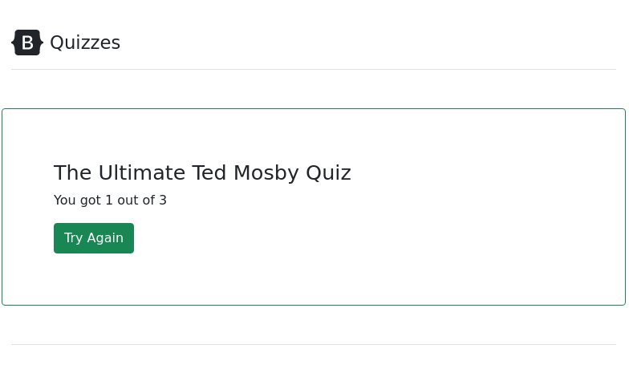
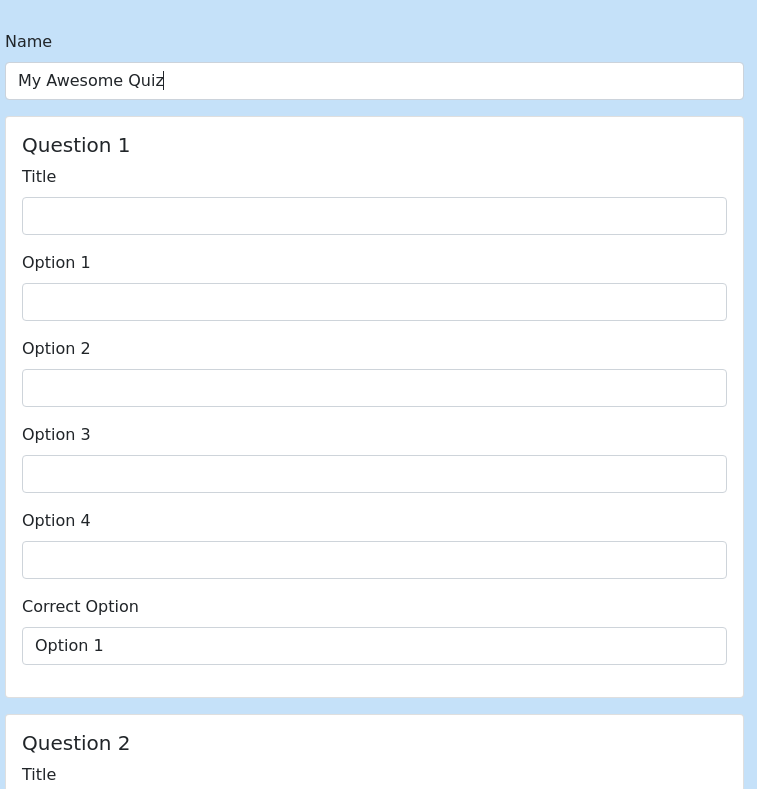

# One CakePHP project a day challenge - Day 09 Quiz

On this project I'm using CakePHP 4, MongoDB and Bootstrap 5

## Steps to create this project

- ec69d0f Initial
- afd3c6b Require mongodb (composer require mongodb/mongodb)
- b2bbc19 Added initial classes to work with mongodb
- f49eccd Added Main Logic to answers the quiz
- 4b6e6a0 Style pages with bootstrap
- cb21a3b Improved style and added javascript to show  one question after other
- 85a861f Added Quiz seed
- 46f689d Improved style
- 42faa5e Added action to add quiz
- 5114f6c Added page to list quizzes

## Pages

